  

  
  
  

## Sobre mim

Front-End / Fullstack Developer na **Neuronex**, construindo a **Anna** — assistente de IA para atendimento de clientes de laboratório.

Formado em Ciência da Computação pela **PUC Minas** (campus Poços de Caldas). Passagens anteriores pela **Kapibara Softwares** e **ID Logistics**.

Gosto de projetos com dados reais, design cuidado e acessibilidade em primeiro plano — não de exercícios genéricos.

## Stack principal

**Front-end**

**Back-end &amp; Dados**

**Ferramentas**

## Projetos em destaque

### Portfólio

Meu site pessoal — carrossel de projetos, conteúdo dinâmico e uma vitrine viva do que ando construindo. Front-end em Next.js com dados no Supabase.

`Next.js` &nbsp; `Supabase`

[**Ver projeto &#8594;**](https://vportfolioweb.vercel.app)

 
 

### Blog do Vinicè

Blog literário com experiência de leitura em formato de livro: virar de páginas, tipografia caprichada e o texto sempre em primeiro plano.

`HTML` &nbsp; `CSS` &nbsp; `JS`

[**Ler o blog &#8594;**](https://blog-do-vinice.vercel.app)

 
 

### DocumenTI

Hub que reúne a documentação de referência de linguagens e frameworks num só lugar — pensado pra quem vive consultando doc no dia a dia.

`TypeScript` &nbsp; `CSS`

[**Ver no GitHub &#8594;**](https://github.com/viniviti/DocumenTI)

 
 

### NexusBank

Dashboard bancário fictício em Angular, sem backend real: os dados vêm de um serviço mock com latência e falhas simuladas, pra treinar loading states e tratamento de erro de forma realista.

`Angular` &nbsp; `TypeScript` &nbsp; `RxJS`

[**Ver projeto &#8594;**](https://github.com/viniviti/NexusBank)

 

[**→ Ver todos os repositórios**](https://github.com/viniviti?tab=repositories)

## Conecte-se

